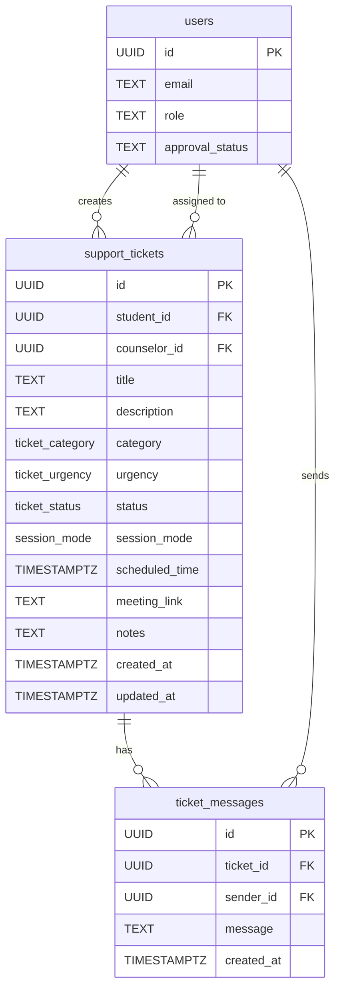

# Database Schema for Enhanced Ticket System

## Tables

### support_tickets

| Column         | Type            | Constraints                            | Description                                            |
| -------------- | --------------- | -------------------------------------- | ------------------------------------------------------ |
| id             | UUID            | PRIMARY KEY, DEFAULT gen_random_uuid() | Unique identifier for the ticket                       |
| student_id     | UUID            | NOT NULL, FK to users(id)              | ID of the student who created the ticket               |
| counselor_id   | UUID            | NULL, FK to users(id)                  | ID of the counselor assigned to the ticket             |
| title          | TEXT            | NOT NULL                               | Title of the support ticket                            |
| description    | TEXT            | NOT NULL                               | Detailed description of the issue                      |
| category       | ticket_category | NOT NULL                               | Category of the ticket (anxiety, depression, etc.)     |
| urgency        | ticket_urgency  | NOT NULL                               | Urgency level (low, medium, high, crisis)              |
| status         | ticket_status   | NOT NULL, DEFAULT 'open'               | Current status of the ticket                           |
| session_mode   | session_mode    | NOT NULL                               | Preferred session mode (video, audio, chat, in-person) |
| scheduled_time | TIMESTAMPTZ     | NULL                                   | Scheduled time for the session                         |
| meeting_link   | TEXT            | NULL                                   | Link to the meeting (e.g., Google Meet)                |
| notes          | TEXT            | NULL                                   | Additional notes from the counselor                    |
| created_at     | TIMESTAMPTZ     | NOT NULL, DEFAULT NOW()                | Timestamp when ticket was created                      |
| updated_at     | TIMESTAMPTZ     | NOT NULL, DEFAULT NOW()                | Timestamp when ticket was last updated                 |

### ticket_messages

| Column     | Type        | Constraints                            | Description                              |
| ---------- | ----------- | -------------------------------------- | ---------------------------------------- |
| id         | UUID        | PRIMARY KEY, DEFAULT gen_random_uuid() | Unique identifier for the message        |
| ticket_id  | UUID        | NOT NULL, FK to support_tickets(id)    | ID of the ticket this message belongs to |
| sender_id  | UUID        | NOT NULL, FK to users(id)              | ID of the user who sent the message      |
| message    | TEXT        | NOT NULL                               | Content of the message                   |
| created_at | TIMESTAMPTZ | NOT NULL, DEFAULT NOW()                | Timestamp when message was sent          |

## Enums

### ticket_category

- 'anxiety'
- 'depression'
- 'stress'
- 'relationships'
- 'academic'
- 'other'

### ticket_urgency

- 'low'
- 'medium'
- 'high'
- 'crisis'

### ticket_status

- 'open'
- 'claimed'
- 'scheduled'
- 'in_progress'
- 'completed'
- 'closed'

### session_mode

- 'video'
- 'audio'
- 'chat'
- 'in-person'

## Indexes

1. `idx_support_tickets_student_id` ON support_tickets(student_id)
2. `idx_support_tickets_counselor_id` ON support_tickets(counselor_id)
3. `idx_support_tickets_status` ON support_tickets(status)
4. `idx_support_tickets_urgency` ON support_tickets(urgency)
5. `idx_support_tickets_created_at` ON support_tickets(created_at)
6. `idx_ticket_messages_ticket_id` ON ticket_messages(ticket_id)
7. `idx_ticket_messages_sender_id` ON ticket_messages(sender_id)
8. `idx_ticket_messages_created_at` ON ticket_messages(created_at)

## Relationships

## Row Level Security (RLS) Policies

### support_tickets

1. **Students can view own tickets**

   - SELECT allowed when `auth.uid() = student_id`

2. **Students can create tickets**

   - INSERT allowed when `auth.uid() = student_id` AND user is approved student

3. **Students can update own tickets**

   - UPDATE allowed when `auth.uid() = student_id`

4. **Counselors can view relevant tickets**

   - SELECT allowed when user is approved counselor AND (status = 'open' OR counselor_id = auth.uid())

5. **Counselors can claim/unclaim tickets**

   - UPDATE allowed when user is approved counselor

6. **Counselors can update assigned tickets**

   - UPDATE allowed when `counselor_id = auth.uid()` AND user is approved counselor

7. **Admins can view all tickets**
   - ALL operations allowed when user is admin

### ticket_messages

1. **Users can view ticket messages**

   - SELECT allowed when user is part of the ticket (student or counselor)

2. **Users can send ticket messages**
   - INSERT allowed when user is part of the ticket AND `sender_id = auth.uid()`

## Triggers

### update_support_tickets_updated_at

- Automatically updates the `updated_at` column whenever a ticket is modified

## Functions

### update_updated_at_column()

- Helper function to set `updated_at` to current timestamp
